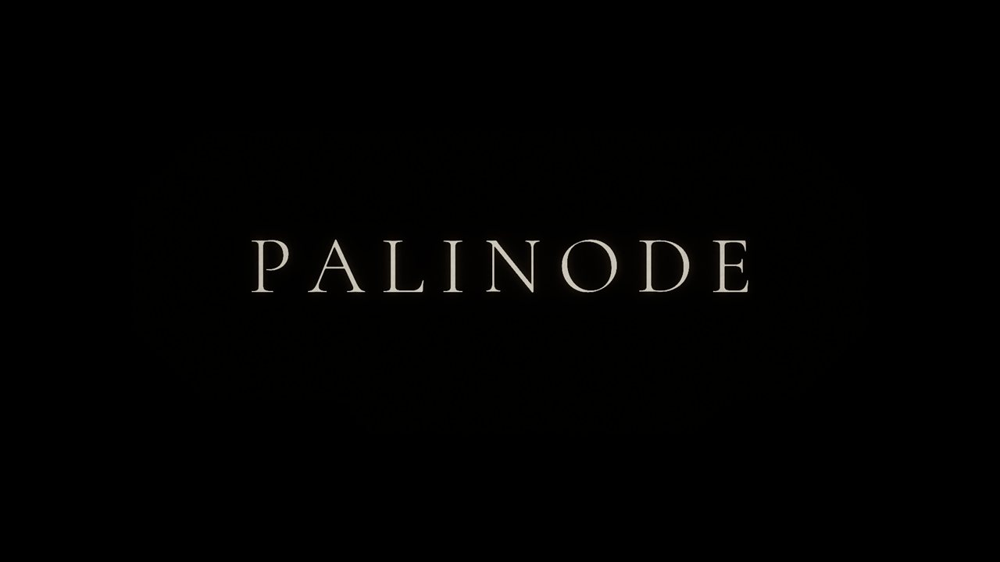
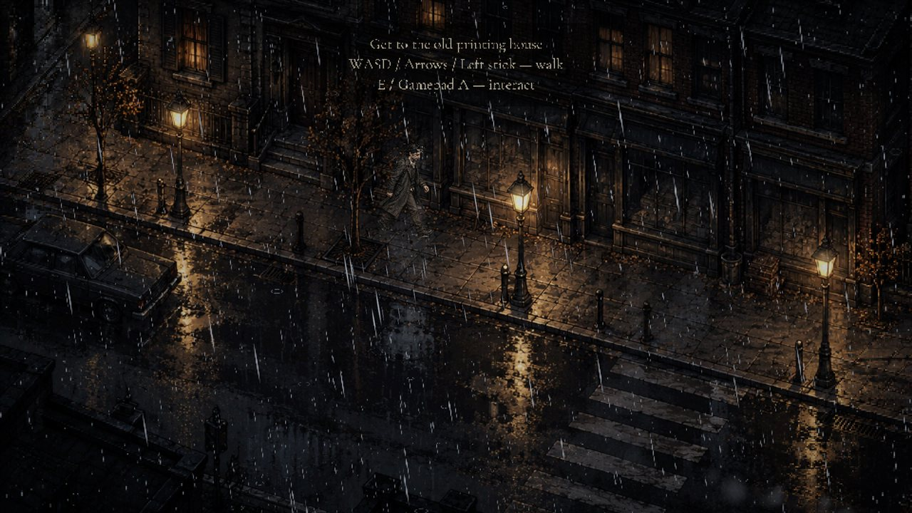
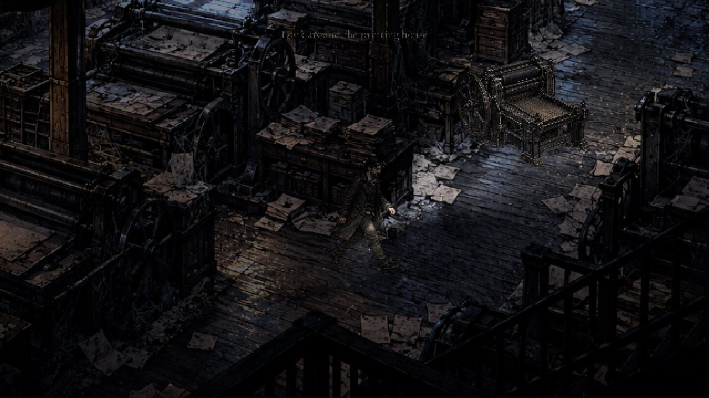
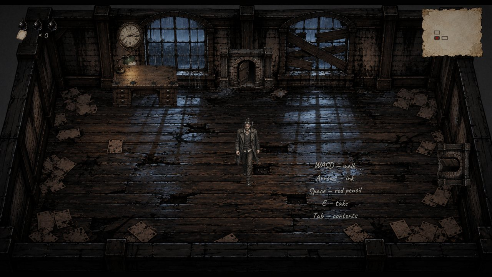
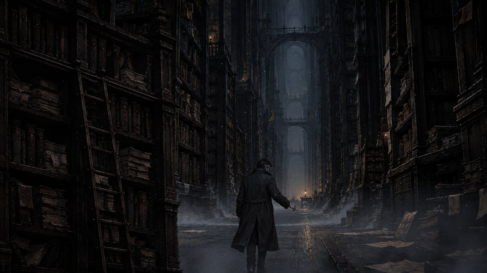

**A story-driven 2D noir game: a cinematic prologue on a rainy night, then a roguelite descent through an old printing house.**

## About

Elias walks through a rain-soaked city to the old **PALINODE** print house. The prologue is played as a
directed sequence of scenes: camera moves, voice lines, handwriting that appears on the page, passing traffic with
headlights and Doppler sound, a ghost truck at the crossing.

After the prologue, **Floor I "The Press"** turns into a top-down roguelite. You fight with ink shots and a red pencil,
explore a procedurally generated floor, and face the boss **Tirazh**. When you die, the story is "revised":
the next run starts as a new **REVISION** and keeps traces of the previous one.

<table>
  <tr>
    <td></td>
    <td></td>
  </tr>
  <tr>
    <td></td>
    <td></td>
  </tr>
</table>

## Features

- **Data-driven cutscenes.** The whole prologue (timings, shots, camera, sounds, music cues) lives in `prologue.json`, so a scene can be changed without touching code.
- **Roguelite Floor I.** Procedural floor from room templates, 5 enemy types, shop, dark rooms, a secret room and a multi-phase boss. All balance values are in `floor1.json`.
- **Audio pipeline.** Music is cut, looped and normalised to target loudness (LUFS) at build time. Music and ambience duck under voice lines.
- **Art pipeline in the editor.** Background removal, sprite slicing, occluder cut-outs and walk-cycle frames are generated by editor tools.
- **One-click project build.** `Tools → PALINODE → Build Everything` sets up URP, post-processing, fonts, scenes and build settings. It also runs in batch mode.
- **Automated tests.** EditMode tests, plus a PlayMode smoke test where an autopilot plays the prologue and Floor I and saves screenshots.
- **EN / RU localization**, with subtitles and handwriting fonts for both languages.

## Controls

| Action | Keyboard | Gamepad |
|---|---|---|
| Walk | WASD | Left stick |
| Ink shot (Floor I) | Arrows | Right stick |
| Red pencil | Space | RB |
| Interact / take | E | A |
| Contents (map) | Tab | Select |
| Pause | Esc | Start |

## Run it

1. Install **Unity 6000.5.10f1** through Unity Hub.
2. Unity Hub → **Add project from disk** → this folder.
3. Open `Assets/_Game/Prologue/Scenes/Menu.unity` and press **Play** → **New Game**.

Tech details, the build pipeline and where every parameter lives: [docs/DEVELOPMENT.md](docs/DEVELOPMENT.md).

## Tech

Unity 6 · C# · URP 2D Renderer · Input System · TextMeshPro · Unity Test Framework
